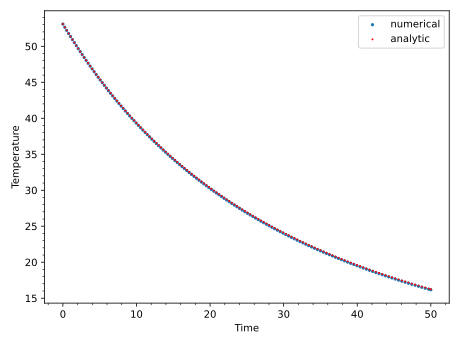
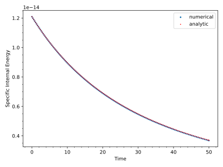
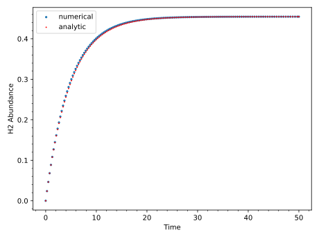
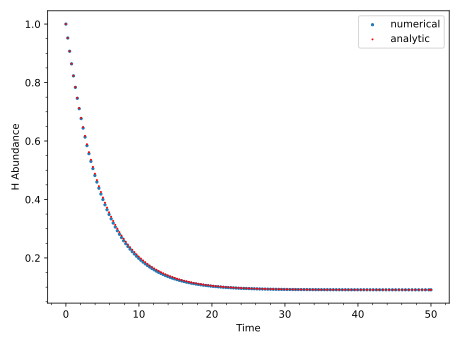
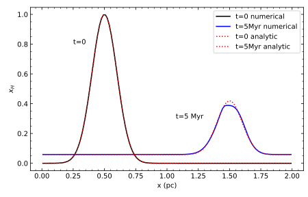
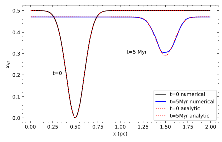

**If you use this chemistry module in your publication, please cite the accompanying code paper [Gong et al. (2023)](https://ui.adsabs.harvard.edu/abs/2023ApJS..268...42G/abstract).**
The paper also provides some more details beyond this documentation.

# Formulation


Chemistry uses the basic functionality of the passive scalars included in the `hydro` or `mhd` modules. The reaction rates act as a source term for the passive scalars. It can also interact with other parts of the code, e.g. heating and cooling rates in the energy equation, the mean molecular weight, opacity in radiation transfer, etc.

# Solving Chemistry

Because the chemical reaction rates for different species often differ by orders of magnitude, implicit solvers are better suited to solve the rate equations. We use the operator split method: after the `hydro`/`mhd` solver has finished, we advance the chemical abundances and the internal energy for the hydrodynamic time step dt, by solving a set of coupled ODEs of chemical rate equations and heating/cooling implicitly:

$$\frac{\mathrm{d} x_s}{\mathrm{d} t} = \mathcal{C}_s$$

$$\frac{\mathrm{d} e}{\mathrm{d} t} = n(\Gamma - \Lambda)$$

In the code, the reaction rate $\mathcal{C}_s$ and the $\frac{de}{dt}$ (heating and cooling) are computed in the `evaluate_function` method of the various chemistry network classes. Because the chemical reaction rate $\mathcal{C}_s$ usually depends on the temperature `T`, the user often need to have some expression of `T` as a function of the internal energy `e` in their RHS. Currently, chemistry works with a adiabatic equation of state with a fixed adiabatic index set by the `gamma` parameter in the `hydro` or `mhd` modules. General EOS dependence on chemistry has not been included yet.

Note that the passive scalar advection (and diffusion) is solved separately prior to the chemical rate equations. This operator split method is only first-order accurate. The forced conservation of elemental abundances (such as by rescaling the flux of different species) has not been implemented yet. Relatively small errors are usually found for elemental conservation from ODE solvers.

# Running the Code

## Input File

To run with chemistry you need to include the `<chemistry>` block in the input file. Within that you have the following parameters

| Option                 | Type   | Allowed Values            | Default              | Description                                                                                                                                 |
| ---------------------- | ------ | ------------------------- | -------------------- | ------------------------------------------------------------------------------------------------------------------------------------------- |
| network                | string | H2, GOW17                 | None, mandatory flag | The chemistry network to use. These networks often have their own runtime parameters which are detailed in their respective sections below. |
| ode_solver             | string | forward_euler, kokkos_BDF | None, mandatory flag | The ODE solver to use. See the [ODE Solvers](ODE-Solvers) page for which solvers are available and any runtime parameters they may have.    |
| mu_H                   | Real   | any real > 1              | 1.4                  | The mean molecular mass per hydrogen nucleon                                                                                                |

Chemistry also requires that the `<units>` module be enabled. A good default set of units to use for ISM chemistry is:

```
<units> 
# ISM units
length_cgs  = 3.0856775809623245e+18  # length is 1 pc
mass_cgs    = 6.195900228622575e+31   # number density is 1 cm^-3
time_cgs    = 3.15576e+13             # time is 1 Myr
mu          = 1.4                     # mean molecular weight
```

# Chemistry

## Passive Scalars

The chemical species uses the passive scalar structure in the code. By default, the number of species is the number of scalars. If the user wants additional passive scalars to be added (for example, tracer scalars that is not involved in chemical reactions), the number of scalars can be set separately in the `nscalars` parameter.

## Existing Chemical Networks

### H2

This is a 2-species HI-H2 network. Although this network is very simplified and does not represent the realistic HI-H2 transition in the ISM, it has the advantage of having an analytic solution when $C_v$ is constant, and is used in tests.

Runtime parameters for the H2 network, these go inside the `<chemistry>` block:

| Option                 | Type   | Allowed Values | Default       | Description                                                                                    |
| ---------------------- | ------ | -------------- | ------------- | ---------------------------------------------------------------------------------------------- |
| h2_constant_cv         | bool   | true, false    | false         | Whether or not $C_v$ should be constant. If true then $C_v$ is set to $1.1 K_b / (\gamma - 1)$ |
| h2_isothermal          | bool   | true, false    | false         | If the H2 network should use an isothermal EOS, i.e. set the change in internal energy to zero |

### GOW17

The GOW17 network is from the work of [Gong, Ostriker and Wolfire (2017)](https://ui.adsabs.harvard.edu/abs/2017ApJ...843...38G/abstract). It is a widely used and well-tested network for carbon and oxygen chemistry in the atomic and molecular ISM. It has the advantage of being relatively simple, with only 18 species and about 50 reactions, while still accurately capturing the most important chemical and thermal processes compared to more sophisticated networks.

Of the 18 species, 12 are evolved directly by the ODE solver (He+, OHx, CHx, CO, C+, HCO+, H2, H+, H3+, H2+, O+, and Si+) while the remaining "ghost" species (Si, C, O, He, e-, and H) are recomputed algebraically from the conservation laws on every function evaluation. The internal energy is evolved alongside the species for a total of 13 equations. Because the reaction rates span many orders of magnitude the network is stiff, so an implicit ODE solver such as [Kokkos BDF](ODE-Solvers#kokkos-bdf) is recommended and the Forward Euler solver is known not to converge in a reasonable amount of time.

Runtime parameters for the GOW17 network, these go inside the `<chemistry>` block:

| Option                           | Type | Allowed Values         | Default                 | Description                                                                                                                    |
| -------------------------------- | ---- | ---------------------- | ----------------------- | -------------------------------------------------------------------------------------------------------------------------------|
| GOW17_Z_d                        | Real | any real $\geq$ 0      | 1.0                     | Dust metallicity relative to solar                                                                                             |
| GOW17_Z_g                        | Real | any real $\geq$ 0      | 1.0                     | Gas-phase metallicity relative to solar. Scales the `GOW17_xC`, `GOW17_xO`, and `GOW17_xSi` abundances                         |
| GOW17_xHe                        | Real | any real $\geq$ 0      | 0.1                     | Helium abundance per hydrogen nucleon                                                                                          |
| GOW17_xC                         | Real | any real $\geq$ 0      | 1.6e-4                  | Carbon abundance per hydrogen nucleon at $Z=1$ (multiplied by `GOW17_Z_g`)                                                     |
| GOW17_xO                         | Real | any real $\geq$ 0      | 3.2e-4                  | Oxygen abundance per hydrogen nucleon at $Z=1$ (multiplied by `GOW17_Z_g`)                                                     |
| GOW17_xSi                        | Real | any real $\geq$ 0      | 1.7e-6                  | Silicon abundance per hydrogen nucleon at $Z=1$ (multiplied by `GOW17_Z_g`)                                                    |
| GOW17_isothermal                 | bool | true, false            | false                   | Use an isothermal EOS, holding the internal energy fixed. If true, `GOW17_mu_iso` and `hydro/iso_sound_speed` must also be set |
| GOW17_mu_iso                     | Real | any real > 0           | mandatory if isothermal | Mean molecular weight used to convert the isothermal sound speed into the fixed temperature                                    |
| GOW17_temperature_min_rates      | Real | any real > 0           | 1.0                     | Minimum temperature (K) for the reaction rates; also applied as a temperature floor in the energy equation                     |
| GOW17_temperature_max_rates      | Real | any real > 0           | $\infty$                | Maximum temperature (K) for the reaction rates. Does not apply to collisional dissociation reactions or the energy equation    |
| GOW17_temperature_max_heating    | Real | any real > 0           | $\infty$                | Temperature (K) above which heating is turned off                                                                              |
| GOW17_temperature_min_cooling    | Real | any real > 0           | 1.0                     | Temperature (K) below which cooling is turned off                                                                              |
| GOW17_temperature_max_cooling_nm | Real | any real > 0           | 1.0e9                   | Temperature (K) at which cooling for the neutral medium is capped                                                              |
| GOW17_Leff_CO_max                | Real | any real > 0           | 3.0e20                  | Maximum effective length (cm) for CO cooling                                                                                   |
| GOW17_H2_rovib_cooling           | bool | true, false            | true                    | Whether to include H2 rovibrational cooling                                                                                    |
| is_kgrH2_const                   | bool | true, false            | false                   | Whether to use a constant H2 formation rate on grains                                                                          |

## Timestep details

Currently, the overall chemical timestep is the same as the hydro timestep: the ODE solver advances the chemical abundances and energy for a single hydro timestep. Note that the ODE solver uses subcycling internally, and the subcycling timestep is adjusted to ensure the solution converges, but this process is hidden from the user. The overall timestep can be reduced by lowering the CFL number and the ODE solvers generally have runtime options to make them more accurate.

## Test Problems

### H2 Uniform

This test problem has a constant hydrodynamic background and follows the evolution of the H and H2 abundances. It has an analytic solution and details can be found in Section 4.1 of [Gong et al. (2023)](https://ui.adsabs.harvard.edu/abs/2023ApJS..268...42G/abstract).

- Input File: [H2_uniform.athinput](../../blob/main-chemistry/inputs/chemistry/H2_uniform.athinput)
- `pgen_name`: H2_uniform

Problem generator parameters, all are within the `<problem>` block unless otherwise specified:

| Option                 | Type   | Default       | Description                                                                        |
| ---------------------- | ------ | ------------- | ---------------------------------------------------------------------------------- |
| n_H                    | Real   | mandatory     | The number density of hydrogen                                                     |
| hydro/iso_sound_speed  | Real   | mandatory     | The isothermal sound speed defined in the `<hydro>` block                          |
| vx_kms                 | Real   | mandatory     | The x velocity in km/s                                                             |
| init_H                 | Real   | mandatory     | The initial abundance of hydrogen gas                                              |
| init_H2                | Real   | mandatory     | The initial abundance of molecular hydrogen                                        |

#### Time Evolution of the H2 Uniform Test






### H2 Advecting Gaussian

This test problem has a Gaussian profile in H and H2 abundances with a constant velocity in $x$. It has an analytic solution and details can be found in Section 4.1 of [Gong et al. (2023)](https://ui.adsabs.harvard.edu/abs/2023ApJS..268...42G/abstract).

- Input File: [H2_advection.athinput](../../blob/main-chemistry/inputs/chemistry/H2_advection.athinput)
- `pgen_name`: H2_advection

Problem generator parameters, all are within the `<problem>` block unless otherwise specified:

| Option                 | Type   | Default       | Description                                                                        |
| ---------------------- | ------ | ------------- | ---------------------------------------------------------------------------------- |
| n_H                    | Real   | mandatory     | The number density of hydrogen                                                     |
| hydro/iso_sound_speed  | Real   | mandatory     | The isothermal sound speed defined in the `<hydro>` block                          |
| vx_kms                 | Real   | mandatory     | The x velocity in km/s                                                             |
| init_H                 | Real   | 0.0           | The initial abundance of hydrogen gas                                              |
| gaussian_mean          | Real   | 0.5           | The mean of the initial Gaussian profile                                           |
| gaussian_std           | Real   | 0.1           | The standard deviation of the initial Gaussian profile                             |

#### Initial and Final States of the H2 Advection Test Compared to the Analytical Solution with `nx=128`



