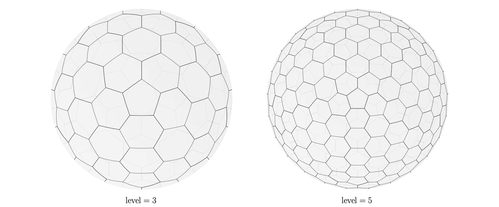

# Radiation Transport

`AthenaK` contains a physics module capable of integrating the time-dependent, frequency-integrated, general relativistic radiation transport equation in stationary spacetimes:

```math
    \frac{\partial \left( n^0 n_0 I \right) }{\partial t} + \frac{1}{\sqrt{-g}} \frac{\partial}{\partial x^i} \left(\sqrt{-g} n^i n_0 I \right) + \frac{1}{\sin \zeta} \frac{\partial}{\partial \zeta} \left( \sin \zeta \; n^\zeta n_0 I \right) + \frac{\partial}{\partial \psi} \left(n^\psi n_0 I \right) = n_0 \left(j - \bar{\alpha} I \right)
```

This flux conservative equation (see [Davis & Gammie 2019](https://arxiv.org/abs/1911.07950)) expresses the time derivative of a "conserved" intensity $`n^0 n_0 \: I`$ as the divergence of fluxes, both spatial (second term) and angular (third and fourth terms). The final term expresses the source term associated with changes in intensity due to emission and absorprtion/scattering. `AthenaK` only supports Minkowski and Cartesian Kerr-Schild metrics for which both have $`\sqrt{-g} = 1`$.

Radiation transport can be enabled in `AthenaK` by simply including the `<radiation>` block in an input file with the appropriate, accompanying mandatory parameters (see [Input File](https://github.com/IAS-Astrophysics/athenak/wikis/The-Input-File) or **Quick Reference** below). Currently, radiation in `AthenaK` requires that `<coord>/general_rel=true`. That is to say, radiation is currently incompatible with Newtonian or SR flows (however, flat space _is_ permitted via `<coord>/general_rel=true` and `<coord>/minkowski=true`, see **Minkowski Space**).

# Quick Reference

### Selecting Physics In the Input File:

GR Radiation Transport (Vacuum): `<radiation>`\
GR Radiation Hydrodyanmics: `<radiation>` + `<hydro>` \
GR Radiation Magnetohydrodynamics: `<radiation>` + `<mhd>`

**_Note_: All GR radiation physics additionally require `<coord>/general_rel=true`.  When `<coord>/general_rel=true`, the `Coordinates` class will also expect the black hole dimensionless spin `<coord>/a`.  `<coord>/minkowski=true` will override metrics and tetrads to give Minkowski space.

### Radiation Input File Parameters:
- `<radiation>/nlevel`: (mandatory) refinement level for geodesic mesh (See **Intensities and Frames**)
- `<radiation>/rotate_geo`: (default: true) rotate geodesic mesh to reduce grid alignment (See **Intensities and Frames**)
- `<radiation>/angular_fluxes`: (default: true) flag to potentially disable angular fluxes (See **Minkowski Space**)
- `<radiation>/reconstruct`: (default: `plm`) set radiation spatial reconstruction algorithm (options: `dc`, `ppm4`, `ppmx`, `wenoz`)  
- `<radiation>/rad_source`: (default: true) enables radiation source term (see **Coupling**)
- `<radiation>/fixed_fluid`: (default: false) if true, solve transport problem without evolving (magneto)hydrodynamics (see **Coupling**)
- `<radiation>/affect_fluid`: (default: true) if false, apply source term to intensity field, but do not feedback on fluid (i.e., disable source term update of $`T^0_\mu`$ from differences in pre- and post-coupling radiation moments; _this is non-conservative_) (see **Coupling**)
- `<radiation>/arad`: (mandatory if `<units>` excluded and `<radiation>/rad_source=true`) radiation constant in code units (see **Radiation Units**)
- `<radiation>/kappa_s`: (mandatory if `<radiation>/rad_source=true`) scattering opacity in code units (or cgs units if `<units>` included) (see **Coupling** and **Radiation Units**)
- `<radiation>/kappa_a`: (mandatory if `<radiation>/rad_source=true` and `<radiation>/power_opacity=false`) absorption opacity in code units (or cgs units if `<units>` included) (see **Coupling** and **Radiation Units**)
- `<radiation>/power_opacity`: (default: false) enable Kramer's type absorption opacity (see **Coupling** and **Radiation Units**)
- `<radiation>/beam_source`: (default: false) flag to enable allocation of beam mask, for use with radiation beam source (see **Beam Source**)
- `<radiation>/dii_dt`: (mandatory if `<radiation>/beam_source`) dI/dt for angular bins flagged in beam mask (see **Beam Source**)


# Intensities and Frames



Integrating the time-dependent transport equation requires a discretization for radiation angular space. We have opted to adopt a geodesic mesh (pictured above) for this purpose. The geodesic grid is constructed via the non-recursive refinement strategy of [Wang & Lee (2011)](https://epubs.siam.org/doi/10.1137/090761355). The geodesic mesh discretizes the unit sphere into hexagons and pentagons, with a total number of angles specified by the level of refinement:

```math
n_\mathrm{angles} = 5 \cdot (2 \; n_{\mathrm{level}}^2) + 2
```

The refinement level `<radiation>/nlevel` must be specified in the input file for a radiation-enabled calculation.

Radiation angular space could be described in a spherical polar coordinate system:

```math
n^{\hat{0}} = 1 \\
n^{\hat{1}} = \sin \zeta \cos \psi \\
n^{\hat{2}} = \sin \zeta \sin \psi \\
n^{\hat{3}} = \cos \zeta
```

where $`\zeta`$ and $`\psi`$ are an angle's polar and azimuthal coordinate, respectively. If a user wishes, the spherical polar coordinate system describing radiation angular space can be rotated to reduce alignment with the spatial grid via `<radiation>/rotate_geo=true`. In all cases, the resultant $`\hat{n}^{\hat{\mu}}`$ computed at cell centers are stored in the `Radiation` class member `DualArray2D<Real> nh_c`.

Intensities (and hence geodesic grids) are defined in an orthonormal tetrad frame. Tetrad frame components $`e^{\mu}_{(\hat{\alpha})}`$ obeying

```math
g_{\mu \nu} e^{\mu}_{(\hat{\alpha})} e^{\nu}_{(\hat{\beta})} = \eta_{\hat{\alpha} \hat{\beta}}
```

inform the transformation between the coordinate frame and the tetrad frame and are used to set the coefficients $`n^{\mu}`$ in the transport equation. Tetrad frame components $`e^{\mu}_{(\hat{\alpha})}`$, Ricci rotation coefficients $`\omega^{\hat{\gamma}}_{\hat{\alpha} \hat{\beta}}`$, and tetrad derivatives are used to compute $`n^\zeta`$ and $`n^\psi`$. Many tetrads could be formulated that obey the constraint $`g_{\mu \nu} e^{\mu}_{(\hat{\alpha})} e^{\nu}_{(\hat{\beta})} = \eta_{\hat{\alpha} \hat{\beta}}`$, however, in `AthenaK`'s `radiation/radiation_tetrad.hpp`, we restrict ourselves to a Cartesian tetrad for a Cartesian Kerr-Schild metric/coordinate system whereby tetrad frame components are specified by $`e^{\mu}_{(\hat{0})} = -\alpha g^{0 \mu}`$ (where $`\alpha`$ is the lapse) with remaining components computed via Gram-Schmidt on Cartesian vectors.  The derivation of the tetrad employed by `AthenaK` can be viewed in [this Mathematica script](uploads/74dbd86185f491f914c2b572f3ae597c/cks_tetrad.nb).

Clearly, there are many coefficients wandering around, each requiring pesky sums/algebra. Additionally, the coordinate frame and tetrad frame are not the only frames in town! We also make heavy use of the normal observer frame and fluid frame (see later **Coupling**). Switching between frames requires unique transformations, sometimes benefitted by yet more data structures. In a perfect world, all coefficients $`n^{\mu}`$, $`n^{\zeta}`$, and $`n^{\psi}`$ could all be computed once at the beginning of the calculation, however, with limited memory on GPUs, we have had to make some sacrifices. For example, instead of allocating memory to hold $`n^{\mu}`$ at both cell- and face-centers, we instead store tetrad frame components, hence requiring a contraction whenever fluxes (or similar) are calculated. Below, we list the data structures employed in `AthenaK`'s radiation module:

### Intensity/Fluxes

- `DvceArray5D<Real> i0`: cell-centered intensity $`n^0 n_0 I`$, _shape/size_: (m, n, k, j, i)
- `DvceArray5D<Real> i1`: cell-centered 2nd register for intensity $`n^0 n_0 I`$ (needed for RK logic), _shape/size_: (m, n, k, j, i)
- `DvceArray5D<Real> coarse_i0`: cell-centered intensity $`n^0 n_0 I`$ on 2x coarser grid (for SMR/AMR), _shape/size_: (m, n, k, j, i)
- `DvceFaceFld5D<Real> iflx`: face-centered spatial intensity fluxes, _shape/size_: (m, n, k, j, i) $`\times`$ 3
- `DvceArray5D<Real> divfa`: cell-centered flux divergence of angular intensity fluxes, _shape/size_: (m, n, k, j, i)

### Frames/Transformations

- `DualArray2D<Real> nh_c`: normal vector $`n^{\hat{\alpha}}`$ defined at angle centers, _shape/size_: (n, 4)
- `DualArray3D<Real> nh_f`: normal vector $`n^{\hat{\alpha}}`$ defined at angle faces (i.e., along hexa/pentagonal edges), _shape/size_: (n, 6, 4)
- `DvceArray6D<Real> tet_c`: cell-centered tetrad components $`e^{\mu}_{(\hat{\alpha})}`$, _shape/size_: (m, 4, 4, k, j, i)
- `DvceArray6D<Real> tetcov_c`: cell-centered covariant tetrad components $`e_{(\hat{\alpha}) \mu}`$, _shape/size_: (m, 4, 4, k, j, i)
- `DvceArray5D<Real> tet_d1_x1f`: X1 face-centered tetrad components $`e^{1}_{(\hat{\alpha})}`$, _shape/size_: (m, 4, k, j, i)
- `DvceArray5D<Real> tet_d2_x1f`: X2 face-centered tetrad components $`e^{2}_{(\hat{\alpha})}`$, _shape/size_: (m, 4, k, j, i)
- `DvceArray5D<Real> tet_d3_x1f`: X3 face-centered tetrad components $`e^{3}_{(\hat{\alpha})}`$, _shape/size_: (m, 4, k, j, i)
- `DvceArray6D<Real> na`: projection of $`n^{\zeta}`$ and $`n^{\psi}`$ onto angle edge normals, _shape/size_: (m, n, k, j, i, 6)
- `DvceArray6D<Real> norm_to_tet`: transformation between normal frame and tetrad frame, _shape/size_: (m, 4, 4, k, j, i)

\*\*_Shape/Size Indexing Note_:

- `m`: `MeshBlock`s in `MeshBlockPack`
- `n`: $`n_\mathrm{angles}`$
- `k`: `<meshblock>/nx3` zones
- `j`: `<meshblock>/nx2` zones
- `i`: `<meshblock>/nx1` zones
- `4`: spacetime directions t, x1, x2, x3
- `3`: space directions x1, x2, x3
- `6`: edges of hexagons (or pentagons with an empty final entry)

# Coupling

A radiation (magneto)hydrodynamics calculation (as opposed to a pure transport problem) is enabled if both the `<radiation>` block and either the `<hydro>` or `<mhd>` block exist in the input file (but not both, `radiation` is not yet compatible with [Ion-Neutral](https://github.com/IAS-Astrophysics/athenak/wikis/Ion-Neutral)). Coupling between the radiation field and (magneto)hydrodynamics is enabled by default.

`AthenaK` currently supports isotropic scattering and absorption. The radiation source term is evolved via an implicit Backward Euler step (see [Jiang et al. 2021](https://arxiv.org/abs/2102.02212) for more details). The source term is carried out in the fluid frame, hence requiring transformations of the specific intensity $`I`$ and solid angles $`\Omega`$ (computed upon geodesic grid construction `prgeo->solid_angles`) from the tetrad frame to the fluid frame. Given a fluid frame frequency-integrated absorption opacity $`\kappa_a`$ and scattering opacity $`\kappa_s`$, the source term will compute the updated intensity in the fluid frame. After transforming the intensity back to the tetrad frame, the difference in the pre- and post-coupling coordinate frame radiation moments inform the update to the (magneto)hydrodynamic conserved variables $`T^0_\mu`$.

At the moment, the scattering opacity can only be constant and is specified in the input file as `<radiation>/kappa_s`. The absorption opacity can be constant if specified directly in the input file via `<radiation>/kappa_a`. If the `<units>` block is included in the input file (see **Radiation Units** and [Units](https://github.com/IAS-Astrophysics/athenak/wikis/Units)), `<radiation>/kappa_s` and `<radiation>/kappa_a` are understood to be in CGS units; otherwise, they are understood to be in code units. If one specifies `<radiation>/power_opacity=true`, the absorption opacity can take on a Kramer's type power law form

```math
\kappa_a = C \; \rho \; T^{-3.5}
```

where $`\rho`$ is the fluid frame density and $`T`$ is the fluid frame temperature. Without including the `<units>` block in the input file, the constant $`C`$ is set to 1, however, if the `<units>` block is included, it is set to $`8 \times 10^{22}`$ such that when $`\rho = \rho_{\mathrm{cgs}}`$ and $`T = T_{\mathrm{cgs}}`$, we recover the Kramer's absorption opacity for fully ionized hydrogen. The setting of opacities subject to the above are carried out in `radiation/radiation_opacities.hpp`.

Various options exist in the codebase to manipulate how coupling is handled. They are detailed below

- `<radiation>/rad_source`: (default: true) enables radiation source term
- `<radiation>/fixed_fluid`: (default: false) if true, solve transport problem without evolving (magneto)hydrodynamics
- `<radiation>/affect_fluid`: (default: true) if false, apply source term to intensity field, but do not feedback on fluid (i.e., disable source term update of $`T^0_\mu`$ from differences in pre- and post-coupling radiation moments; _this is non-conservative_).

# Minkowski Space

The implementation of radiation transport is carried out in full general relativity, therefore, it is also capable of working in Minkowski (flat) space. When `<coord>/general_rel=true` and `<coord>/minkowski=true` are both specified in the input file, the tetrad frame components calculated in `radiation/radiation_tetrad.hpp` will simplify to diag(1, 1, 1, 1). By extension, all angular fluxes should be zero when `<coord>/minkowski=true`. Rather than evolving zeroes, one can disable angular fluxes by specifying `radiation/angular_fluxes=false` (this is also a valuable debug tool for non-flat space).

# Radiation Units

The radiation physics module handles units differently for two different workflows: (1) if the `<units>` block is specified in the input file and (2) when it is not.

First, consider the case that the `<units>` block is not included. In this scenario, when `radiation/rad_source=true`, the radiation constant $`a_\mathrm{rad}`$ must be set via `radiation/arad` and opacities must be set via `radiation/kappa_s` and `radiation/kappa_a` (unless computed automatically via `radiation/power_opacity=true`; see above), where all are assumed to be provided in code units.

In the scenario that the `<units>` block is included, $`a_\mathrm{rad}`$ is set automatically from the prescribed density unit `<units>/density_cgs`, black hole mass (in solar masses) `<units>/bhmass_msun`, and mean molecular mass (in amu) `<units>/mu`, e.g.,

```
<units>
density_cgs = 1.0e-2
bhmass_msun = 10.0
mu = 0.5
```

Accordingly, `<radiation>/kappa_s` and `<radiation>/kappa_a` (if `radiation/power_opacity=false`) are assumed to have been specified in cgs units.

# Radiation Beams

A common test problem is to send off beams of radiation in a given space time. When `<radiation>/beam_source=true` is specified in the input file, an additional

- `DvceArray5D<bool> beam_mask`: cell-centered intensity mask, _shape/size_: (m, n, k, j, i)

is allocated. In a problem generator, one can set specific angles in the boolean mask to `true` in order to illuminate that bin. For example, one might wish to set up a flashlight beam with a given spatial width and finite opening angle in either flat space or about a (spinning) black hole. The boolean mask is referenced in a source term update (not to be confused with the radiation coupling source term) which updates the intensity in the triggered angular bins by `<radiation>/dii_dt` over a numerical time step.