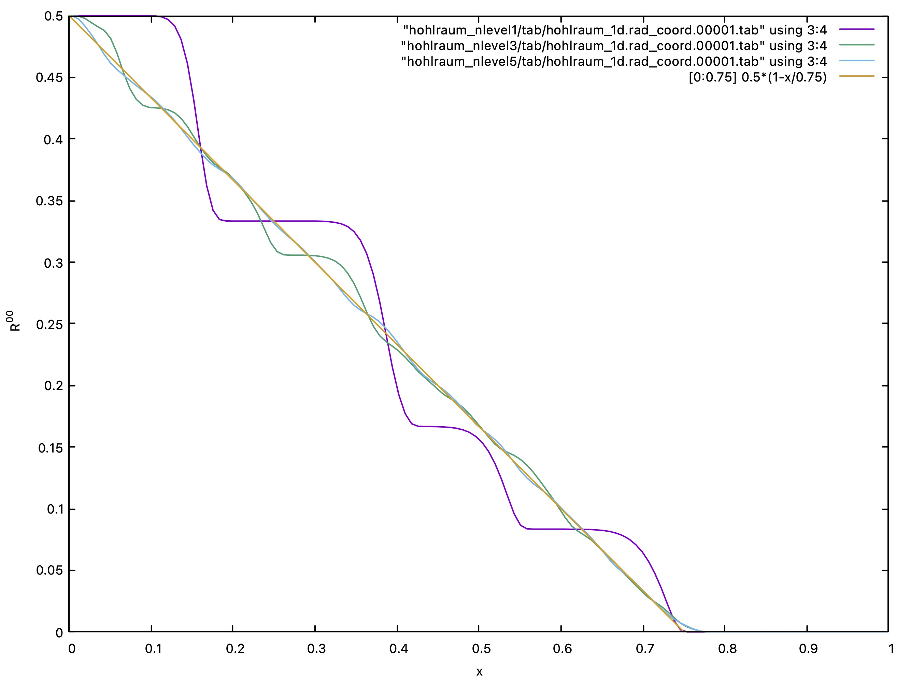

This tutorial provides a basic introduction to running `AthenaK`.  It is where all new users should start. It is based on the `Athena++` Tutorial, which is recommended for further reference.

### Contents

1. Hydrodynamics and MHD
2. SMR and AMR
3. Special and General Relativity
4. Radiation Transport
5. Running on a Single GPU
6. Running on Multiple GPUs 

# 1. Hydrodynamics and MHD
# 2. SMR and AMR
# 3. Special and General Relativity
# 4. Radiation Transport
In the following, we present a quick tutorial for running general relativistic radiation transport in `AthenaK`. [Ryan & Dolence (2019)](https://arxiv.org/abs/1907.09625) presented the Hohlraum streaming test whereby the time evolution of a radiation field is tracked after initializing a boundary of a 1D domain with an isotropic radiation field (with radiation energy density $`R^{00}_\mathrm{boundary} = 1`$). From simple geometric arguments, one can find an analytic solution for the coordinate frame radiation energy density $`R^{00}`$ at time $`t`$ and position $`x`$:

```math
R^{00}_\mathrm{analytic} = \frac{1}{2} \left( 1 - \frac{x}{t} \right )
```

Let's begin by building `AthenaK` on an x86 compatible processor (see [Build](https://github.com/IAS-Astrophysics/athenak/wikis/Build)).  From within the `AthenaK` main directory, running
```
cmake -B build 
```
creates a build directory for `AthenaK` called `build`.  Let's dive into `build/src/`,
```
cd build/src/
```
and make the executable (using all available threads):
```
make -j
```
Next, let's next inspect the input file for the 1D Hohlraum test included in `inputs/tests/hohlraum_1d.athinput` relative to the `AthenaK` main directory.  The `<time>` block
```
<time>
evolution  = dynamic  # dynamic/kinematic/static
integrator = rk2      # time integration algorithm
cfl_number = 0.5      # The Courant, Friedrichs, & Lewy (CFL) Number
nlim       = -1       # cycle limit
tlim       = 0.75     # time limit
```
reports that we will run the simulation (1) using a second order RK2 integrator (Heun's method), (2) with a CFL number equal to 0.5, and (3) to a final time `tlim = 0.75` without a cycle limit `nlim = -1`.   Next, let's move on to the `<mesh>` input file block:
```
<mesh>
nghost = 2         # Number of ghost cells
nx1    = 128       # Number of zones in X1-direction
x1min  = 0.0       # minimum value of X1
x1max  = 1.0       # maximum value of X1
ix1_bc = inflow    # inner-X1 boundary flag
ox1_bc = outflow   # outer-X1 boundary flag

nx2    = 1         # Number of zones in X2-direction
x2min  = -0.5      # minimum value of X2
x2max  = 0.5       # maximum value of X2
ix2_bc = periodic  # inner-X2 boundary flag
ox2_bc = periodic  # outer-X2 boundary flag

nx3    = 1         # Number of zones in X3-direction
x3min  = -0.5      # minimum value of X3
x3max  = 0.5       # maximum value of X3
ix3_bc = periodic  # inner-X3 boundary flag
ox3_bc = periodic  # outer-X3 boundary flag
```
Here, we see the problem has been specified to be 1D (with `<mesh>/nx2 = <mesh>/nx3 = 1`).  We will resolve a $x \in [0, 1]$ spatial domain with `<mesh>/nx1=128` zones.  At the inner `X1` boundary condition, we will invoke `ix1_bc=inflow` boundary conditions corresponding to an isotropic radiation source.  The outer X1 boundary condition will be `ox1_bc=outflow`.

Next, onto the `<coord>` block:
```
<coord>
general_rel = true    # w/ general relativity
minkowski = true      # Minkowski flag
```
This problem is carried out in flat space, however, recall that the `AthenaK` radiation physics module requires general relativity.  Therefore, we specify `coord/general_rel=true`.  Instead of invoking the Cartesian Kerr-Schild metric for this problem, we enable flat space by specifying `<coord>/minkowski=true`.  

To enable the radiation physics module in `AthenaK`, one must include the `<radiation>` block in the input file.  
```
<radiation>
nlevel = 1              # number of levels for geodesic mesh
```
Here, `<radiation>/nlevel=1` corresponds to the refinement level of the geodesic grid used to discretize radiation angular space (see [Radiation](https://github.com/IAS-Astrophysics/athenak/wikis/Radiation)).  An `nlevel=1` geodesic mesh corresponds to a mere 12 angles.  As elsewhere, many radiation parameters will be set by default (see [Radiation](https://github.com/IAS-Astrophysics/athenak/wikis/Radiation)), for example, for this input file, `<radiation>/reconstruct=plm` (Piecewise Linear Reconstruction) has been implicitly set.  

Finally, as we hope to inspect simulation output, let's designate an output block:
```
<output1>
file_type   = tab        # output format
data_format = %24.16e    # output precision
variable    = rad_coord  # choice of variables to output
dt          = 1.0        # output cadence
```
of `.tab` format, with specified output precision equal to full precision, at an output cadence larger than `<time>/tlim` such that only the initial condition and final solution are dumped.  We will output the coordinate frame radiation moments `<output1>/variable=rad_coord`.  

Next, let's dive into the Hohlraum Problem Generator file `src/pgen/tests/rad_hohlraum.cpp` (relative to the main `AthenaK` directory).  To be verbose, we explicitly launch a kernel to zero the intensity in every angle of every spatial zone for every `MeshBlock` in the `MeshBlockPack` (albeit unnecessary since `Kokkos::View`s are initialized to zero, see [Kokkos View Initialization](https://github.com/kokkos/kokkos/wiki/View#642-initialization)).  By excluding the `<meshblock>` block from our input file, we have implicitly designated only a single `MeshBlock` in the `MeshBlockPack`.
```
  // capture variables for kernel
  MeshBlockPack *pmbp = pmy_mesh_->pmb_pack;
  auto &indcs = pmy_mesh_->mb_indcs;
  int &ng = indcs.ng;
  int n1 = indcs.nx1 + 2*ng;
  int n2 = (indcs.nx2 > 1) ? (indcs.nx2 + 2*ng) : 1;
  int n3 = (indcs.nx3 > 1) ? (indcs.nx3 + 2*ng) : 1;
  int nmb1 = (pmbp->nmb_thispack-1);
  int nang1 = (pmbp->prad->prgeo->nangles-1);

  auto &i0 = pmbp->prad->i0;
  par_for("rad_hohlraum",DevExeSpace(),0,nmb1,0,nang1,0,(n3-1),0,(n2-1),0,(n1-1),
  KOKKOS_LAMBDA(int m, int n, int k, int j, int i) {
    i0(m,n,k,j,i) = 0.0;
  });
```
In the above, we capture variables for our kernel including the total number of zones (including ghost cells) in each dimension `n1`, `n2`, and `n3`.  We capture the total number of `MeshBlock`s minus one (`par_for` loops are inclusive) `nmb1`.  And finally, we capture the total number of angles from the `Radiation` object's `GeodesicGrid` instance `nang1 = pmbp->prad->prgeo->nangles - 1`.  Finally, we capture the intensity array `pmbp->prad->i0` which will be set in our kernel launch.  We are not done.  Because we have specified `<mesh>/ix1_bc = inflow`, we must set the BoundaryValue `pmbp->prad->pbval_i->i_in` `DualArray2D<Real>`.  
```
  auto &i_in = pmbp->prad->pbval_i->i_in;
  for (int n=0; n<=nang1; ++n) {
    i_in.h_view(n,BoundaryFace::inner_x1) = (-1.0/(4.0*M_PI));
  }
  i_in.template modify<HostMemSpace>();
  i_in.template sync<DevExeSpace>();
```
Recall that we wish to set up our inner boundary condition as an isotropic radiation source with coordinate frame radiation energy density $`R^{00}=1`$.  This means that each angle should be initialized with intensity $`I = 1/4\pi`$.  In the above, we go through each angle and set the inner_x1 boundary to this value.  _**Notice the appearance of a minus sign**_: the intensity array `i0` and boundary `i_in` are truthfully the conserved intensity $`n^0 n_0 I`$;  in flat space, $`n^0 n_0 = -1`$.  

Next, let's run the test problem.  From within `build/src/`, run

```
./athena -i ../../inputs/tests/hohlraum_1d.athinput -d hohlraum_nlevel1
```

This will execute the program, running our 1D Hohlraum test with an `nlevel=1` geodesic grid and place the outputs in an output directory specified with the `-d` flag, `hohlraum_nlevel1/`.  

Input file parameters can be overridden on the command line.  Let's rerun the calculation with a level 3 and level 5 geodesic grid.  

```
./athena -i ../../inputs/tests/hohlraum_1d.athinput -d hohlraum_nlevel3 radiation/nlevel=3
./athena -i ../../inputs/tests/hohlraum_1d.athinput -d hohlraum_nlevel5 radiation/nlevel=5
```

Now there should be three output directories containing dumps from calculations invoking three different angular resolutions for the radiation field.  Let's plot the result and compare to the analytic solution! Here we use `gnuplot`.  Runnning

```
gnuplot> set xlabel "x"
gnuplot> set ylabel "R^{00}"
gnuplot> plot "hohlraum_nlevel1/tab/hohlraum_1d.rad_coord.00001.tab" using 3:4 with lines, \
              "hohlraum_nlevel3/tab/hohlraum_1d.rad_coord.00001.tab" using 3:4 with lines, \
              "hohlraum_nlevel5/tab/hohlraum_1d.rad_coord.00001.tab" using 3:4 with lines, \
              [0:0.75] 0.5*(1-x/0.75) with lines
```
produces the following: 


Clearly the `nlevel=1` geodesic grid under-resolves the problem but as the angular resolution increases, we converge on the analytic (orange) solution.  


# 5. Running on a Single GPU
# 6. Running on Multiple GPUs 